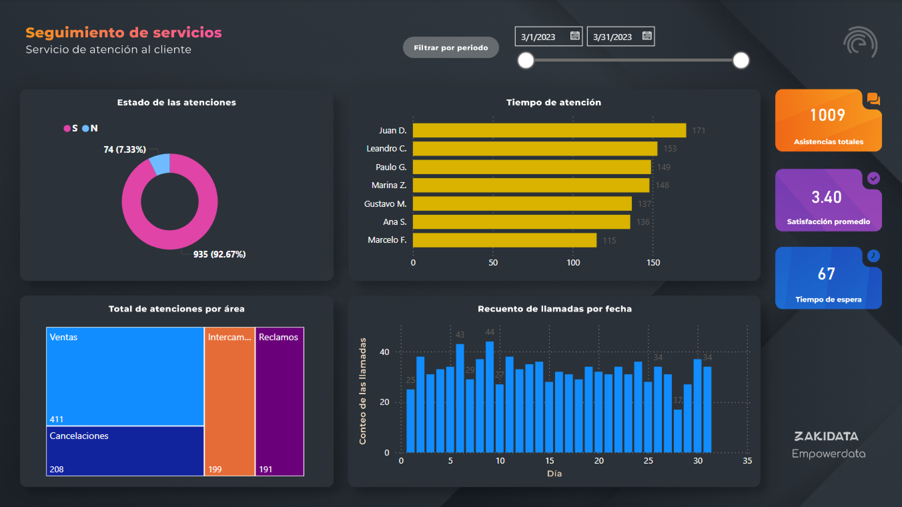
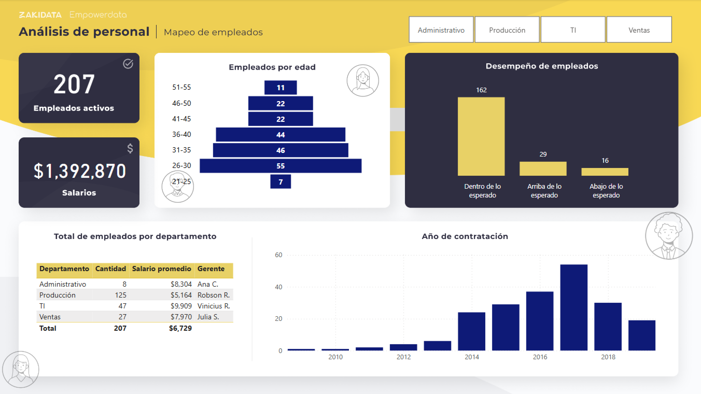
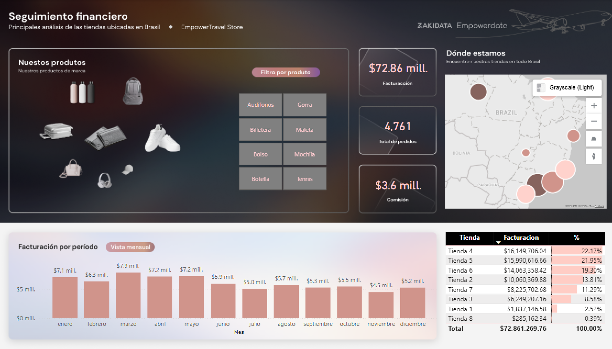
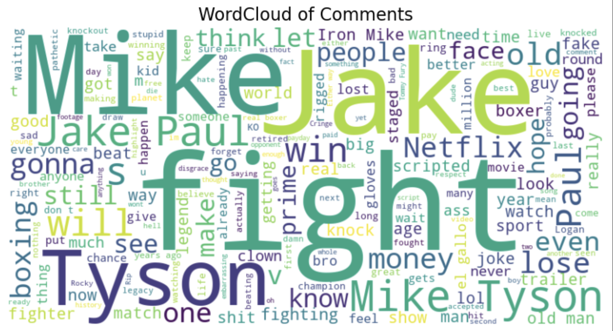

# Portfolio - Lexa Pérez

## 👩‍💻 About Me
Economist and aspiring Data Analyst with skills in **Python, SQL, Excel, and Power BI**. Passionate about analyzing data and turning it into actionable insights.

---

## 📊 Projects

### 1. Call Center Efficiency Dashboard
- **GitHub Repo:** [Call Center Efficiency Dashboard](https://github.com/lexaperez/CallCenter_Efficiency_Dashboard)  
- **Description:** Tracks key call center KPIs such as calls answered, handling time, waiting time, and efficiency by area.  
- **Preview:**  

### 2. HR Analytics Dashboard
- **GitHub Repo:** [HR Analytics Dashboard](https://github.com/lexaperez/HR_Analytics_Dashboard)  
- **Description:** Analyzes employee distribution, performance, salaries, age, and tenure.  
- **Preview:**  

### 3. Retail Financial Dashboard
- **GitHub Repo:** [Retail Financial Dashboard](https://github.com/lexaperez/Retail_Financial_Dashboard)  
- **Description:** Monitors sales, revenue, commissions, and orders across multiple stores and locations.  
- **Preview:**  

### 4. SQL Data Cleaning Project – Layoffs Dataset
- **GitHub Repo:** [SQL_Layoffs_Data_Cleaning](https://github.com/lexaperez/SQL_Layoffs_Data_Cleaning)
- **Description:** SQL project focused on cleaning and standardizing a layoffs dataset. Includes duplicate removal, data standardization, handling of missing values, and correction of date formats.
- **Key Tools:** MySQL, CTEs, window functions, data cleaning techniques.

### 5. Exploratory Data Analysis & ML Pipeline for Diabetes Progression
- **GitHub Repo:** [EDA & ML Pipeline for Diabetes Progression](https://github.com/lexaperez/EDA-Diabetes)
- **Description:** Exploratory Data Analysis (EDA) and end-to-end machine learning pipeline built to predict diabetes progression, measuring performance gains via RMSE after targeted data cleaning, missing value imputation, and categorical encoding.
- **Key Tools:** Python, Pandas, Scikit-learn, Seaborn, Jupyter Notebook.

### 6. YouTube Sentiment Analysis: Jake Paul vs. Mike Tyson (trailer)
- **GitHub Repo:** [YouTube Sentiment Analysis: Jake Paul vs. Mike Tyson (trailer)](https://github.com/lexaperez/youtube_sentiment_analysis_jakepaulvsmiketyson)
- **Description:** Analysis of public perception and YouTube community reactions to one of the most publicized boxing events in recent history. Using NLP techniques, comments from the official trailer were extracted and processed to classify sentiment polarity (positive, neutral, or negative) and uncover the most recurring terms.
- **Key Tools:** Python, NLTK, Seaborn & WordCloud.
- **Preview:**

---

## 📌 Skills
- **Data Analysis:** Python, Pandas, NumPy, SQL, Excel, Power BI, AWS
- **Business Intelligence:** Interactive dashboards, KPIs, executive reports  
- **Soft Skills:** Proactive, adaptable, problem-solving, fast learner  

---

## 📧 Contact
- Email: lexaperez24@gmail.com  
- GitHub: [https://github.com/lexaperez](https://github.com/lexaperez)
- LinkedIn: [www.linkedin.com/in/lexaperez](www.linkedin.com/in/lexaperez)

---

# ESPAÑOL

# Portafolio - Lexa Pérez

## 👩‍💻 Sobre Mí
Economista y aspirante a Analista de Datos con habilidades en **Python, SQL, Excel y Power BI**. Apasionada por analizar datos y convertirlos en información útil para la toma de decisiones.

---

## 📊 Proyectos

### 1. Dashboard de Eficiencia de Call Center
- **Repositorio:** [Call Center Efficiency Dashboard](https://github.com/lexaperez/CallCenter_Efficiency_Dashboard)  
- **Descripción:** Monitorea KPIs clave de un call center, incluyendo llamadas atendidas, tiempo de atención, tiempo de espera y eficiencia por área.  
- **Vista Previa:**  

### 2. Dashboard de Analítica de Recursos Humanos
- **Repositorio:** [HR Analytics Dashboard](https://github.com/lexaperez/HR_Analytics_Dashboard)  
- **Descripción:** Analiza la distribución de empleados, desempeño, salarios, edad y años de contratación.  
- **Vista Previa:**  

### 3. Dashboard Financiero de Tiendas
- **Repositorio:** [Retail Financial Dashboard](https://github.com/lexaperez/Retail_Financial_Dashboard)  
- **Descripción:** Monitorea ventas, ingresos, comisiones y pedidos en varias tiendas y ubicaciones.  
- **Vista Previa:**  

### 4. Proyecto de Limpieza de Datos en SQL – Base de Despidos
- **Repositorio:** [SQL_Layoffs_Data_Cleaning](https://github.com/lexaperez/SQL_Layoffs_Data_Cleaning)
- **Descripción:** Proyecto en SQL enfocado en la limpieza y estandarización de una base de datos de despidos. Incluye eliminación de duplicados, estandarización de datos, manejo de valores nulos y corrección de formatos de fecha.
- **Herramientas:** MySQL, CTEs, funciones de ventana y técnicas de limpieza de datos.

### 5. Análisis Exploratorio de Datos y Pipeline de Machine Learning para la Progresión de la Diabetes
- **Repositorio:** [EDA & ML Pipeline for Diabetes Progression](https://github.com/lexaperez/EDA-Diabetes)
- **Descripción:** Análisis exploratorio de datos (EDA) y pipeline de machine learning enfocado en predecir la progresión de la diabetes, evaluando la optimización del modelo mediante la métrica RMSE tras la limpieza de datos, imputación de valores faltantes y codificación categórica.
- **Herramientas:** Python, Pandas, Scikit-learn, Seaborn, Jupyter Notebook.

### 6. Análisis de Sentimientos de Youtube: Jake Paul vs. Mike Tyson (trailer)
- **Repositorio:** [YouTube Sentiment Analysis: Jake Paul vs. Mike Tyson (trailer)](https://github.com/lexaperez/youtube_sentiment_analysis_jakepaulvsmiketyson)
- **Descripción:** Análisis de la percepción pública y las reacciones de la comunidad de YouTube ante uno de los eventos de boxeo más mediáticos de los últimos tiempos. Mediante técnicas de NLP, se extrajeron y procesaron los comentarios del tráiler oficial para clasificar la polaridad de las opiniones (positivo, neutral o negativo) y descubrir los términos más recurrentes.
- **Herramientas:** Python, NLTK, Seaborn & WordCloud.
- **Vista Previa:**

---

## 📌 Habilidades
- **Análisis de Datos:** Python, Pandas, NumPy, SQL, Excel, Power BI, AWSS
- **Inteligencia de Negocios:** Dashboards interactivos, KPIs, reportes ejecutivos  
- **Habilidades Blandas:** Proactiva, adaptable, resolución de problemas, aprendizaje rápido  

---

## 📧 Contacto
- Email: lexaperez24@gmail.com   
- GitHub: [https://github.com/lexaperez](https://github.com/lexaperez)
- LinkedIn: [www.linkedin.com/in/lexaperez](www.linkedin.com/in/lexaperez)
