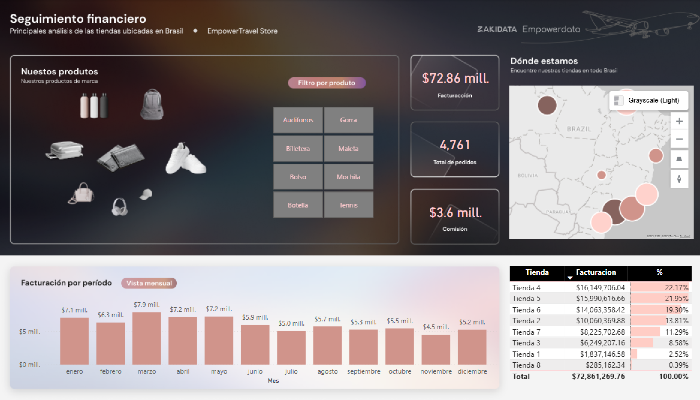

# Portfolio - Lexa Pérez

## 👩‍💻 About Me
Economist and aspiring Data Analyst with skills in **Python, SQL, Excel, and Power BI**. Passionate about analyzing data and turning it into actionable insights.

---

## 📊 Projects

### 1. Call Center Efficiency Dashboard
- **GitHub Repo:** [Call Center Efficiency Dashboard](https://github.com/lexaperez/CallCenter_Efficiency_Dashboard)  
- **Description:** Tracks key call center KPIs such as calls answered, handling time, waiting time, and efficiency by area.  
- **Preview:**  

### 2. HR Analytics Dashboard
- **GitHub Repo:** [HR Analytics Dashboard](https://github.com/lexaperez/HR_Analytics_Dashboard)  
- **Description:** Analyzes employee distribution, performance, salaries, age, and tenure.  
- **Preview:**  

### 3. Retail Financial Dashboard
- **GitHub Repo:** [Retail Financial Dashboard](https://github.com/lexaperez/Retail_Financial_Dashboard)  
- **Description:** Monitors sales, revenue, commissions, and orders across multiple stores and locations.  
- **Preview:**  

---

## 📌 Skills
- **Data Analysis:** Python, Pandas, NumPy, SQL, Excel, Power BI  
- **Business Intelligence:** Interactive dashboards, KPIs, executive reports  
- **Soft Skills:** Proactive, adaptable, problem-solving, fast learner  

---

## 📧 Contact
- Email: lexaperez24@gmail.com  
- GitHub: [https://github.com/lexaperez](https://github.com/lexaperez)

---

# ESPAÑOL

# Portafolio - Lexa Pérez

## 👩‍💻 Sobre Mí
Economista y aspirante a Analista de Datos con habilidades en **Python, SQL, Excel y Power BI**. Apasionada por analizar datos y convertirlos en información útil para la toma de decisiones.

---

## 📊 Proyectos

### 1. Dashboard de Eficiencia de Call Center
- **Repositorio:** [Call Center Efficiency Dashboard](https://github.com/lexaperez/CallCenter_Efficiency_Dashboard)  
- **Descripción:** Monitorea KPIs clave de un call center, incluyendo llamadas atendidas, tiempo de atención, tiempo de espera y eficiencia por área.  
- **Vista Previa:**  

### 2. Dashboard de Analítica de Recursos Humanos
- **Repositorio:** [HR Analytics Dashboard](https://github.com/lexaperez/HR_Analytics_Dashboard)  
- **Descripción:** Analiza la distribución de empleados, desempeño, salarios, edad y años de contratación.  
- **Vista Previa:**  

### 3. Dashboard Financiero de Tiendas
- **Repositorio:** [Retail Financial Dashboard](https://github.com/lexaperez/Retail_Financial_Dashboard)  
- **Descripción:** Monitorea ventas, ingresos, comisiones y pedidos en varias tiendas y ubicaciones.  
- **Vista Previa:**  

---

## 📌 Habilidades
- **Análisis de Datos:** Python, Pandas, NumPy, SQL, Excel, Power BI  
- **Inteligencia de Negocios:** Dashboards interactivos, KPIs, reportes ejecutivos  
- **Habilidades Blandas:** Proactiva, adaptable, resolución de problemas, aprendizaje rápido  

---

## 📧 Contacto
- Email: lexaperez24@gmail.com   
- GitHub: [https://github.com/lexaperez](https://github.com/lexaperez)
